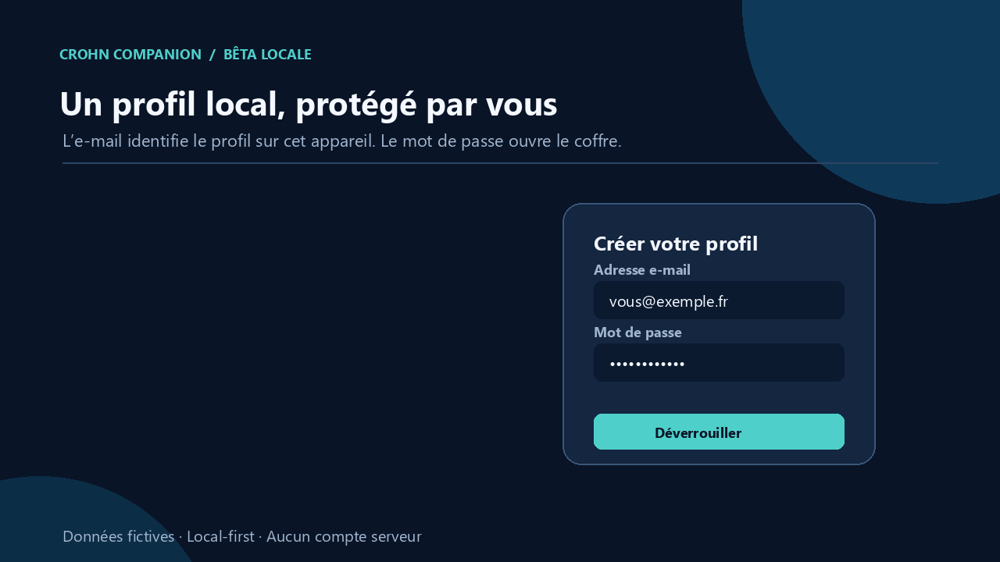

# Crohn Companion — Documentation publique

> **Statut : démonstration publique local-first** — pas un dispositif médical certifié.

Ce dépôt contient uniquement la **documentation** de Crohn Companion, une PWA React/TypeScript qui aide une personne vivant avec la maladie de Crohn à suivre ses symptômes, selles, traitements et à préparer une discussion avec son équipe soignante.

Le **code source vit dans un dépôt privé**. Ce dépôt public existe pour donner une transparence vérifiable sur la finalité, les données traitées, l'architecture de confidentialité et les limites du produit, sans exposer l'ensemble du code applicatif. Un accès en lecture au code source peut être accordé sur demande motivée (contact ci-dessous).

## Ce que fait l'application (résumé)

- Journal quotidien : selles (échelle de Bristol), symptômes, traitements, photos optionnelles.
- Suivi des prises déclarées et oublis explicitement déclarés — jamais déduits d'une absence de saisie.
- Score HBI calculé à partir des données déclarées, présenté comme repère de suivi, pas un diagnostic.
- Synthèse des données déclarées pour la consultation, exportable en PDF.
- Aucune donnée de santé ne quitte l'appareil sans action explicite de l'utilisateur (export CSV/JSON/PDF).

Elle ne diagnostique pas, ne remplace pas un professionnel de santé et ne doit pas être utilisée pour trier une urgence.

## Appel à participation (bêta ouverte)

Le projet cherche des retours pour progresser, de deux profils en particulier :

- **Patients et aidants** : testez le parcours réel (saisie, planning de traitements, synthèse PDF) et signalez ce qui est confus, incorrect ou manquant. Le mode démo permet de tester sans saisir de données réelles.
- **Professionnels de santé** : une relecture du contenu clinique (formule et seuils HBI, échelle de Bristol, libellés) par un médecin ou un(e) soignant(e) serait précieuse avant tout usage élargi — voir [compliance/plan_validation_clinique.md](compliance/plan_validation_clinique.md) et [compliance/sources_cliniques.md](compliance/sources_cliniques.md) pour l'état actuel des sources.

Cette bêta n'est pas un dispositif médical certifié et ne remplace pas un avis médical. Pour participer ou remonter un retour : [crohnapp@gmail.com](mailto:crohnapp@gmail.com).

## Dossier conformité

Rédigé pour être lisible par un non-technicien, il reflète l'architecture réelle de l'application :

| Fichier | Objet |
|---|---|
| [compliance/finalite_application.md](compliance/finalite_application.md) | Ce que fait l'application et ce qu'elle ne fait pas |
| [compliance/donnees_collectees.md](compliance/donnees_collectees.md) | Inventaire des données traitées et de leur stockage |
| [compliance/registre_traitements_rgpd.md](compliance/registre_traitements_rgpd.md) | Analyse RGPD adaptée au mode local |
| [compliance/politique_suppression_donnees.md](compliance/politique_suppression_donnees.md) | Comment supprimer / exporter ses données |
| [compliance/analyse_risque_securite.md](compliance/analyse_risque_securite.md) | Risques identifiés et mesures de réduction |
| [compliance/sources_cliniques.md](compliance/sources_cliniques.md) | Références des scores et échelles utilisés |
| [compliance/limites_dispositif_medical.md](compliance/limites_dispositif_medical.md) | Statut non-DM et frontières à ne pas franchir |
| [compliance/hbi_calcul.md](compliance/hbi_calcul.md) | Formule, source, seuils et version du calcul HBI |
| [compliance/flux_donnees.md](compliance/flux_donnees.md) | Vérification documentée des flux de données (« local-first ») |
| [compliance/plan_validation_clinique.md](compliance/plan_validation_clinique.md) | Plan de validation terrain (beta) |
| [compliance/journal_changements.md](compliance/journal_changements.md) | Journal des évolutions notables |

## Autre documentation

- [docs/TECHNICAL_DATA_FLOW_AUDIT.md](docs/TECHNICAL_DATA_FLOW_AUDIT.md) — audit statique du code source : absence de télémétrie tierce et de fuite de données de santé.
- [docs/EXPORT_SECURITY.md](docs/EXPORT_SECURITY.md) — sauvegardes chiffrées et limites de récupération.
- [docs/international-rollout.md](docs/international-rollout.md) — porte de revue avant tout nouveau pays.

## Fonctionnement local et confidentialité

- Aucun compte serveur requis. L'e-mail est un identifiant local sur l'appareil, jamais synchronisé.
- Le mot de passe déverrouille un coffre local chiffré (AES-GCM-256, clé dérivée par PBKDF2-SHA-256). Après un rechargement, un profil réel se reverrouille : le mot de passe n'est jamais stocké.
- Aucun outil d'analytics tiers ni traceur publicitaire (voir l'audit technique ci-dessus).

## Périmètre médical et réglementaire

Produit prêt pour une démonstration technique et un pilote fermé, sous revue humaine. Il n'est pas présenté comme un dispositif médical, un service d'urgence, une solution de diagnostic ou un produit certifié HAS/RGPD-santé/HDS/HIPAA.

## Hors périmètre actuel

Volontairement absents de cette version : publication sur un store applicatif (Google Play/App Store), synchronisation cloud, publicité et tout traceur commercial. Ce sont des directions possibles pour une phase ultérieure, chacune conditionnée à une revue légale, clinique et de sécurité dédiée.

## Contact

Pour toute question, retour de participation ou demande d'accès en lecture au code source : [crohnapp@gmail.com](mailto:crohnapp@gmail.com)

---

# English

> **Status: public local-first demo** — not a certified medical device.

This repository contains only the **documentation** for Crohn Companion, a React/TypeScript PWA that helps people living with Crohn's disease track symptoms, stool logs and medication, and prepare better conversations with their care team.

The **source code lives in a private repository**. This public repository exists to provide verifiable transparency on the product's purpose, data handling, privacy architecture and boundaries, without exposing the full application code. Read access to the source can be granted on request (contact below).

It does not diagnose, replace a clinician, or triage emergencies.

## Call for participation (open beta)

The project is looking for feedback from two groups in particular:

- **Patients and caregivers**: try the real journey (logging, medication schedule, PDF summary) and report anything confusing, incorrect or missing. Demo mode lets you try it without entering real data.
- **Healthcare professionals**: a review of the clinical content (HBI formula and thresholds, Bristol scale, wording) by a clinician would be valuable before any wider use — see [compliance/plan_validation_clinique.md](compliance/plan_validation_clinique.md) and [compliance/sources_cliniques.md](compliance/sources_cliniques.md) for the current state of sources.

This beta is not a certified medical device and does not replace medical advice.

## Contact

For questions, feedback, or a source-code read-access request: [crohnapp@gmail.com](mailto:crohnapp@gmail.com)
