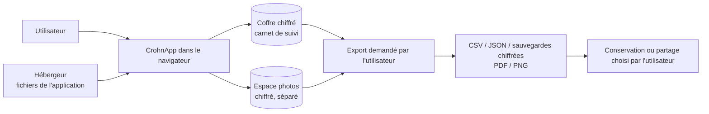

# Où vont les données (« local-first »)

*Vérification du 13 août 2026, CrohnApp v1.1.0. À refaire avant toute version qui ajouterait un
échange avec un serveur.*

La formulation publique autorisée est : « Les données sont enregistrées localement par défaut.
L'utilisateur peut les consulter, les modifier, les exporter et les supprimer. » Les formulations
absolues — « 100 % privé », « zéro risque », « conformité garantie » — restent interdites.

## État vérifié

| Sujet | Constat en v1.1.0 |
| --- | --- |
| Carnet de suivi | Enregistré dans un coffre chiffré sur l'appareil, ouvert par le mot de passe du profil. |
| Photos | Enregistrées chiffrées dans un espace séparé, jamais téléversées. |
| Compte | Aucun serveur d'identité. Le profil et son mot de passe sont locaux ; pas de « mot de passe oublié » à distance. |
| Base distante | Aucune. Aucune synchronisation entre appareils. |
| Sauvegardes | Deux sauvegardes distinctes, carnet et photos, créées et restaurées manuellement. Aucune sauvegarde automatique dans le cloud. |
| PDF et PNG | Produits sur l'appareil. L'application ne les envoie nulle part ; un partage éventuel est choisi par l'utilisateur. |
| Mesure d'audience et rapports d'erreur | Aucun outil tiers. La page « Analyses » calcule tout sur l'appareil. |
| Liens externes | Navigation volontaire vers des pages publiques ou ouverture du logiciel de messagerie. Aucune donnée du carnet n'est placée dans ces liens. |

## Hébergement

L'application est servie sous forme de fichiers statiques. Comme tout hébergeur, le prestataire
voit les requêtes de chargement, notamment l'adresse IP et le type de navigateur. Le contenu du
carnet ne figure pas dans ces requêtes.

## Ce qui rendrait cette vérification caduque

L'ajout d'un compte serveur, d'une base distante, d'une synchronisation, d'une sauvegarde dans le
cloud, d'une mesure d'audience, d'un rapport d'erreur automatique, d'un envoi d'e-mail intégré, ou
de tout échange transportant des données utilisateur.

## Aller plus loin

Ce document décrit le comportement observable, pas l'implémentation. Pour une question technique
précise ou une demande de lecture du code : [crohnapp@gmail.com](mailto:crohnapp@gmail.com).
