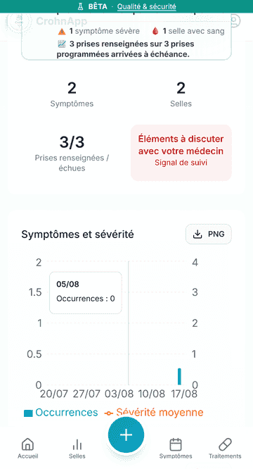

# Exporter une analyse en PNG sur mobile

L'export PNG permet de conserver ou de partager l'image d'un graphique sans faire de capture d'écran.
Le fichier est généré sur l'appareil à partir des données affichées ; CrohnApp ne l'envoie à aucun
serveur.

1. Ouvrez **Analyses** et choisissez la période à afficher.
2. Repérez le graphique voulu, puis touchez son bouton **PNG**.
3. Le téléchargement démarre et CrohnApp confirme « PNG exporté ».
4. Ouvrez le fichier depuis les téléchargements du téléphone. Il contient le titre, la période,
   la légende, la date d'export et la version de CrohnApp.

Le PNG reprend uniquement les données déclarées. Il ne constitue ni un diagnostic, ni un compte
rendu médical. Vérifiez son contenu avant de l'envoyer et utilisez un canal adapté : l'image peut
contenir des informations de santé lisibles par toute personne qui reçoit le fichier.
