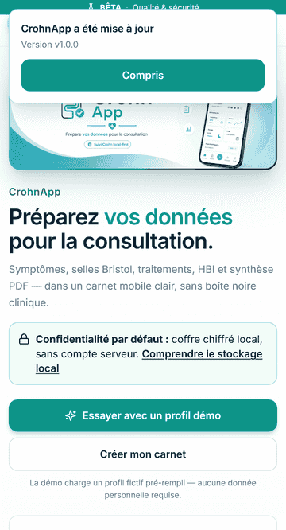

# Mettre à jour CrohnApp sur Android

CrohnApp peut désormais se mettre à jour sans être désinstallée. Chrome peut appliquer une version
silencieusement lorsque l'application est fermée ; dans ce cas, CrohnApp confirme la version active
à la prochaine ouverture.

1. Gardez une connexion Internet active et fermez complètement CrohnApp.
2. Fermez aussi les onglets `crohnapp.com` encore ouverts dans Chrome.
3. Rouvrez CrohnApp. Si « Mise à jour disponible » apparaît, touchez **Rafraîchir**.
4. CrohnApp confirme ensuite la version installée. Elle reste consultable dans **Profil**.

> Ne désinstallez jamais CrohnApp et n'effacez jamais ses données avant d'avoir créé et vérifié une
> sauvegarde. Le coffre médical est stocké uniquement sur l'appareil.

Les installations très anciennes peuvent avoir été créées avant la correction du mécanisme de mise
à jour. Si l'application reste bloquée, créez d'abord les sauvegardes clinique et photos chiffrées,
conservez leurs mots de passe séparément, puis contactez le projet avant toute réinstallation.
