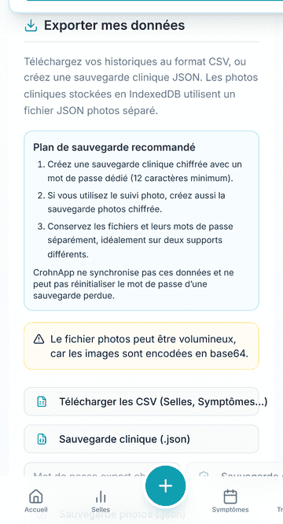
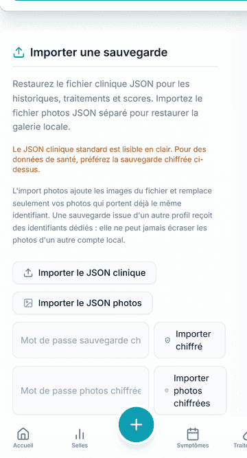

# Sauvegarder et restaurer ses données

Les données de CrohnApp restent sur l'appareil. Une sauvegarde est donc indispensable avant un
changement de téléphone, une réinstallation exceptionnelle ou une opération risquée.

## Créer la sauvegarde clinique chiffrée

1. Ouvrez **Données & export**, puis **Exporter mes données**.
2. Saisissez un mot de passe dédié d'au moins 12 caractères.
3. Touchez **Sauvegarde chiffrée** et confirmez exactement le même mot de passe.
4. Conservez le fichier et son mot de passe dans deux endroits séparés.
5. Si vous utilisez les photos, créez aussi la sauvegarde **Photos chiffrées** : elle est séparée.

CrohnApp ne connaît pas ces mots de passe et ne peut pas les réinitialiser.

## Restaurer la sauvegarde

1. Ouvrez **Importer une sauvegarde**.
2. Saisissez le mot de passe avant de choisir le fichier.
3. Touchez **Importer chiffré** et sélectionnez la sauvegarde clinique correspondante.
4. Attendez « Restauration chiffrée réussie » avant de quitter la page.
5. Restaurez séparément le fichier photos si vous en avez créé un.

Ne supprimez jamais le fichier d'origine avant d'avoir rouvert CrohnApp et vérifié les données
restaurées.
